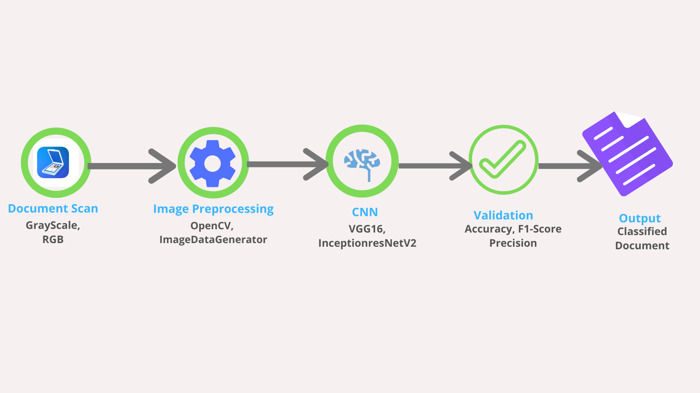

# Scanned-Document-Classification
BFSI sectors deal with lots of unstructured scanned documents which are archived in document management systems for further use.For example in Insurance sector, when a policy goes for underwriting, underwriters attached several raw notes with the policy, Insureds also attach various kind of scanned documents like identity card, bank statement, letters etc. In later parts of the policy life cycle if claims are made on a policy, releted scanned documents also archeived.Now it becomes a tedious job to identify a particular document from this vast repository. The goal of this case study is to develop a deep learning based solution which can automatically classify scanned documents.

# Data
We will use the RVL-CDIP (Ryerson Vision Lab Complex Document Information Processing) dataset which consists of 400,000 grayscale images in 16 classes, with 25,000 images per class. There are 320,000 training images, 40,000 validation images, and 40,000 test images. The images are sized so their largest dimension does not exceed 1000 pixels.

link : https://www.cs.cmu.edu/~aharley/rvl-cdip/

## Folder Structure
Data -- link to download data                                                                                      
Models -- link to download trained models                                                                                           
Notebooks --DocManagement.ipynb (Anchor notebook), paramtune (Notebook for paramenter tunning)                                                
PDF -- Notebook snapshots in PDF format                                                                                             
Scripts -- Necessary scripts to recreate the result   
Screenshots -- All screenshots from the trining and evaluation process                                                       

## Training Stretegy
We will use CNN(Convolution Neural Networks) to address the problem.Instead of developing our own model from scratch we will use transfer learning (here we will use models pretrined on ImageNet).The current SOTA model for this genere of problem uses inter and intra domain transfer learning where an image is divided in to four parts header,footer,left body and right body. A pretrained vgg16 model is first used to train over the whole images(inter domain) then this model is used to train the part of images(Intra domain).

In this experiment we will take a different approach. Instead of intradomain trainsfer learning using vgg16, we will develope two parallel models VGG16 and InceptionResNetV2 and will stack the model.Our assumtion is that because of the different structure of these two models they will learn the different ascept of images and stacking them will result good generalization.

How hyperparameters will be tuned? For any CNN the hypermeters are : pooling size, network size, batch size,choice of optimizers, learning rate,regularization,input size etc.
To keep the main notebook neet we will do this experiments discreatly. We have develope some utility functions in paramtune.ipynb notebook. Suppose after 10 epoch we got an accuacy of 47%. We will use this model as testing baseline at that point and using the utility funtions we will check which configuration set(i.e. bach_size/optimizer/learning_rate) will result better accuracy in future epochs.
We will use Cyclic Learning Rate in the training process where the learning rate will start increasing slowly over iteration and reduce gradually after reaching the threshold. We will also reduce learning rate if accuracy does not improves after some predefined number of epochs.

In various phase we have tried with                                                                               
image size : 64/128/224                                                                                                        
optimizers: vanila SGD/rmsprop/adam/adamax
batch_size: 50/64/128                                                                                                         
learning rate: 10^-4 to 0.1                                                                                                        

## Preferable Hardware Requirments
GPU
16/24 GB RAM
500 GB HDD (minimum 200GB)
## Steps to Recreate
Download the data from given link                                                                                                     
Execute final method in Final.ipynb to execute the whole pipeline                                                                                       
Execute individual scripts/notebook to execute modules
## License
MIT license

## Update APR 2021
The code was originally written upon tensorflow < 2.0, to implement currently the dependencies need to be updated acordingly  
